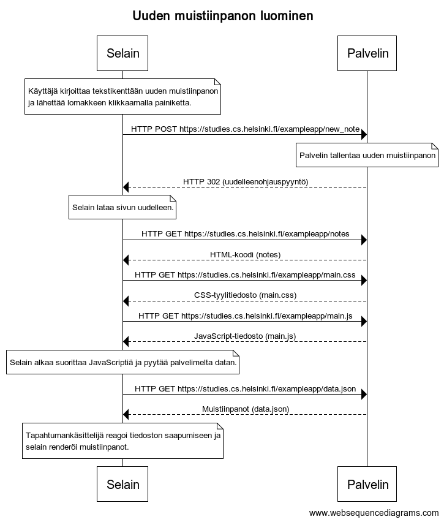

# Osan 0 tehtävien vastaukset

## 0.4: uusi muistiinpano


```
title Uuden muistiinpanon luominen

note over Selain:
Käyttäjä kirjoittaa tekstikenttään uuden muistiinpanon
ja lähettää lomakkeen klikkaamalla painiketta.
end note
Selain->Palvelin: HTTP POST https://studies.cs.helsinki.fi/exampleapp/new_note
note over Palvelin:
Palvelin tallentaa uuden muistiinpanon
end note
Palvelin-->Selain: HTTP 302 (uudelleenohjauspyyntö)
note over Selain:
Selain lataa sivun uudelleen.
end note
Selain->Palvelin: HTTP GET https://studies.cs.helsinki.fi/exampleapp/notes
Palvelin-->Selain: HTML-koodi (notes)
Selain->Palvelin: HTTP GET https://studies.cs.helsinki.fi/exampleapp/main.css
Palvelin-->Selain: CSS-tyylitiedosto (main.css)
Selain->Palvelin: HTTP GET https://studies.cs.helsinki.fi/exampleapp/main.js
Palvelin-->Selain: JavaScript-tiedosto (main.js)
note over Selain:
Selain alkaa suorittaa JavaScriptiä ja pyytää palvelimelta datan.
end note
Selain->Palvelin: HTTP GET https://studies.cs.helsinki.fi/exampleapp/data.json
Palvelin-->Selain: Muistiinpanot (data.json)
note over Selain:
Tapahtumankäsittelijä reagoi tiedoston saapumiseen ja
selain renderöi muistiinpanot.
end note
```